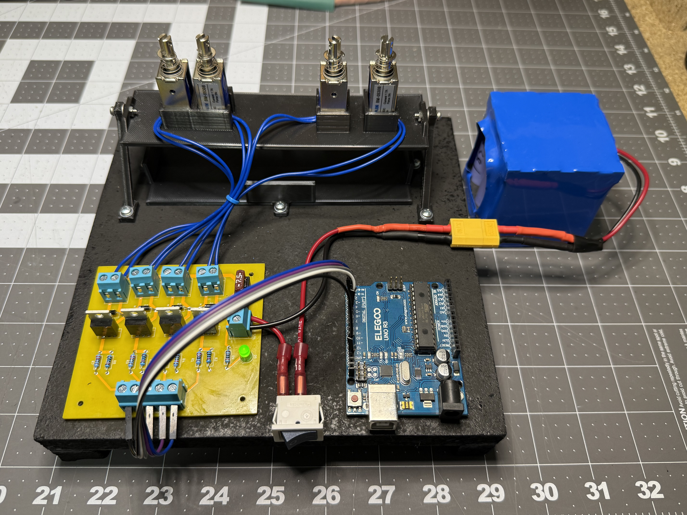
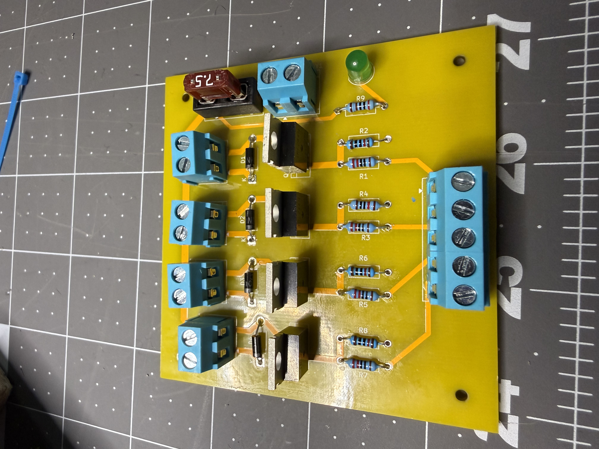
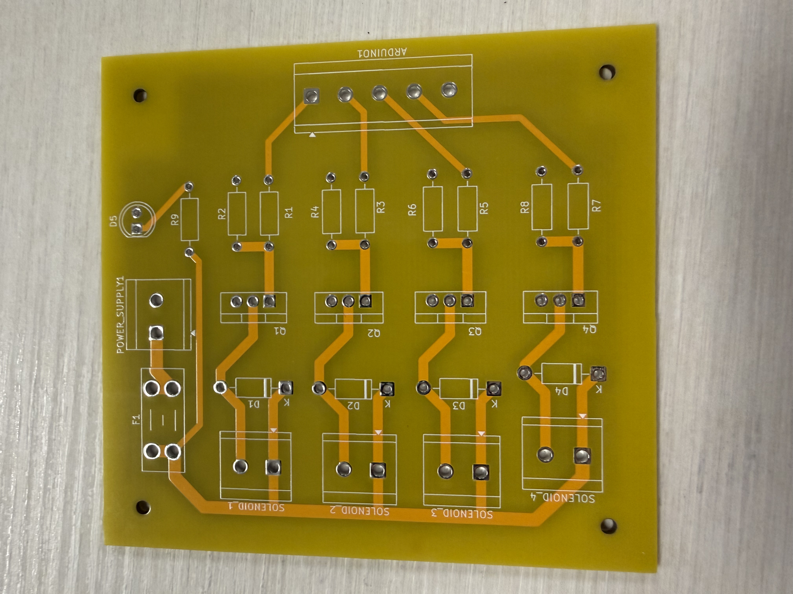
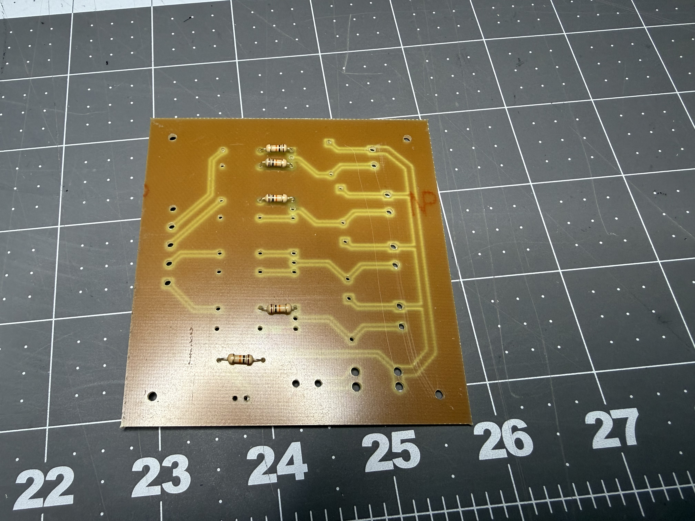
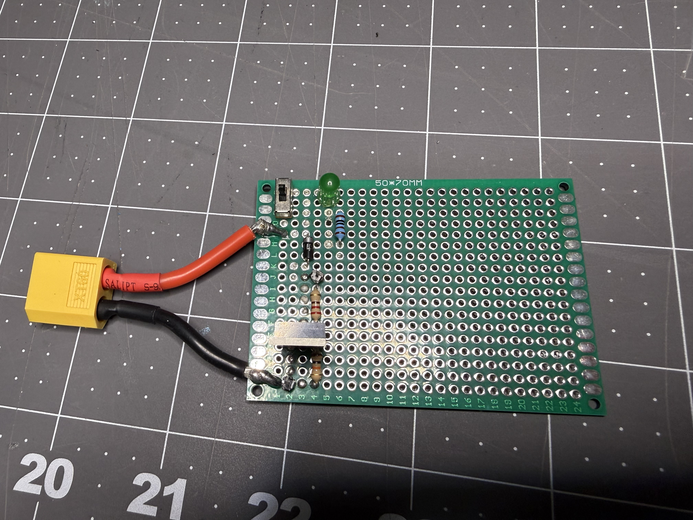

# Photos

Miscellaneous photos of the various hardware components throughout different stages of development.

## Contents

Full assembly of all the components. The build plate is a piece of 1/2" particle board that was spray painted black. Bottom-left: circuit board. Bottom-right: Arduino. Top: controller cradle and actuator plate. Right: power supply and connector.

Final circuit with all components soldered on. This board was designed by Sam Culp and manufactured by JLCPCB. The components were ordered from DigiKey. 

SNES controller firmly held in its cradle. The gantry frame supports four solenoid linear actuators that are positioned right above the buttons.

Initial concept for the layout of all the different components. This ended up closely resembling the final version.

Circuit board as it arrived from the manufacturer. Corresponds with revision v4.0. Did not come with any components mounted, just through-holes.

First attempt at manufacturing a circuit board. Corresponds with revision v2.0. Sam Culp manufactured this in the Electronics Lab at Wichita State. This is a one-sided board made from a clad-copper PCB blank. Rather than laying down wires on a piece of material, the machine routed out the silhouette of each wire. Sam had to ensure proper sizing of the traces and annular rings to match the available drill bits.

Early proof-of-concept of the circuit soldered onto a protoboard. This board drives one actuator and takes one digital input from an arduino. The cables for the actuator were transplanted to the final build prior to this photo being taken.