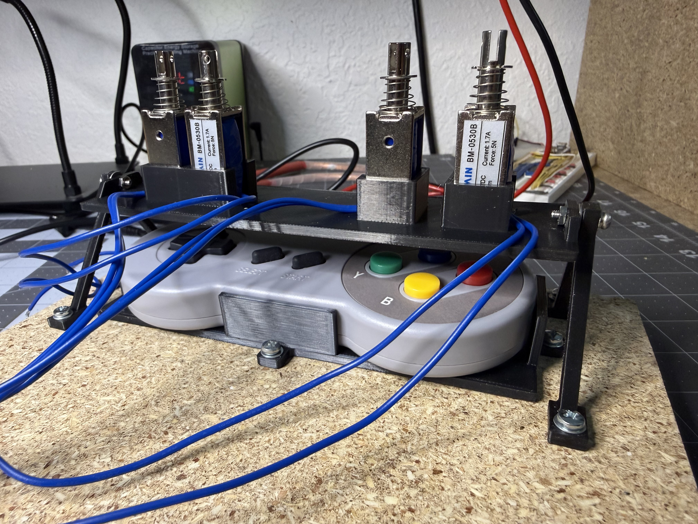
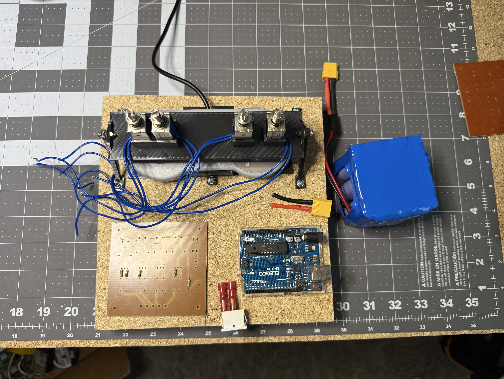

# Photos

Miscellaneous photos of the different hardware components at different stages of development.

## Contents

SNES controller firmly held in its cradle. The gantry frame supports four solenoid linear actuators that are positioned right above the buttons.

Initial concept for the layout of all the different components. This ended up closely resembling the final version.

